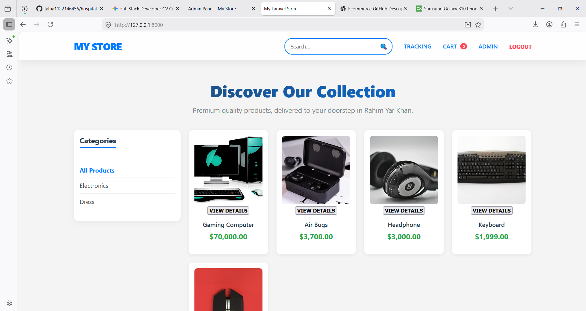
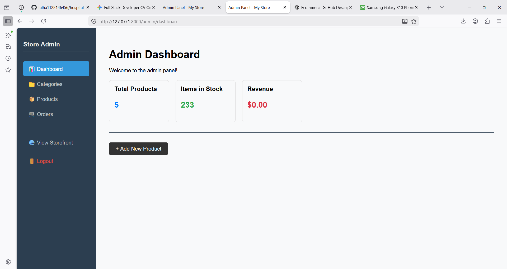
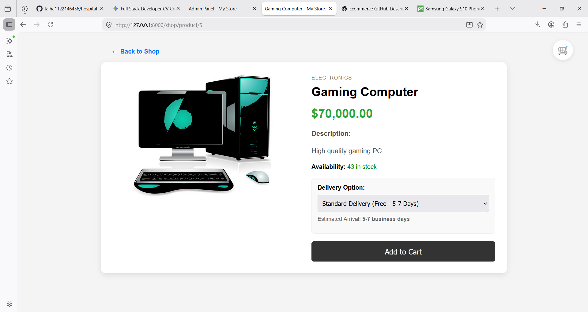
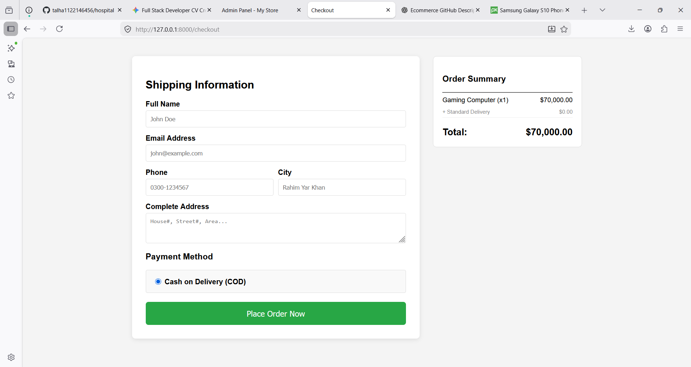

# 🛒 Full-Stack Ecommerce Platform

A robust, professional Ecommerce application built with **PHP Laravel**. This project features a complete shopping experience for users and a powerful management system for administrators.

## 🚀 Core Features

### 👤 Customer Features
* **Secure Authentication:** User registration and login with **OTP (One-Time Password) Verification** for enhanced security.
* **Product Discovery:** Browse products by categories with a responsive UI.
* **Shopping Cart:** Add, remove, and update product quantities in real-time.
* **Checkout System:** Secure checkout process with order placement tracking.
* **Order Tracking:** Customers can track their order status directly from the site.

### 🛠️ Admin Panel Features
* **Comprehensive Dashboard:** Overview of sales, orders, and products.
* **Catalog Management:** Full CRUD (Create, Read, Update, Delete) for Categories and Products.
* **Order Management:** View order details, update status, and manage customer requests.
* **Invoice Generation:** Generate and view professional invoices for every order.
* **Authentication:** Dedicated secure login for administrative access.

## 📸 Screenshots
<p align="center">
  
  
</p>
<p align="center">
  
  
</p>

## 🛠️ Tech Stack
* **Backend:** PHP 8.x, Laravel Framework
* **Frontend:** JavaScript, HTML, CSS, Bootstrap
* **Database:** MySQL (Relational Database Design)
* **Version Control:** Git & GitHub

## 🔧 Installation & Setup

1. **Clone the repository**
   ```bash
   git clone [https://github.com/talha1122146456/Ecommerce.git](https://github.com/talha1122146456/Ecommerce.git)
   cd Ecommerce
